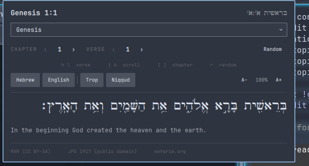

# Verse

An Omarchy bar widget that drops down a small reader for the Tanakh: pick a
reference and see it in **Hebrew** (the vocalised Masoretic text) and the
**JPS 1917** English translation, one above the other.



## Use

- **Left-click** the widget to open the dropdown.
- **Book** — the dropdown at the top (type to filter the 39 books).
- **Chapter / Verse** — the `‹ N ›` steppers. The arrows roll across chapter
  borders and grey out at the start of Genesis / end of Chronicles.
- **Random** — a random passage from the Tanakh.
- **Middle-click** the bar widget for a random verse without opening it first.
- **Right-click** the bar widget to toggle whether the current reference is
  shown next to the icon in the bar.

The verses either side of where you are (and a little into the neighbouring
chapters), plus a small pool of random passages, are fetched in the
background, so moving around is normally instant. The controls disable
themselves while a verse is actually loading, so mashing them can't queue up
a pile of requests.

### Keyboard (with the panel focused)

| key | |
|-----|-----|
| `h` / `l`  (or `←` / `→`) | previous / next **verse** |
| `j` / `k`  (or `↑` / `↓`) | **scroll** a long passage |
| `[` / `]`  (or `H` / `L`) | previous / next **chapter** |
| `r` | random passage |
| `−` / `+` | text smaller / bigger |
| `0` | reset text size to 100% |
| `Esc` | close |

### Display

A row of toggles under the navigation:

- **Hebrew** / **English** — show each independently (or neither).
- **Trop** — cantillation marks (te'amim) on/off.
- **Niqqud** — vowel points on/off.
- **A− / A+** — text size, 75%–200%. Click the **percentage** to reset to 100%.

The chapter and verse steppers know each book's real shape (how many
chapters, and how many verses in the current chapter), pulled from Sefaria's
`/api/shape`, so they can't run past the end.

The last reference you viewed and all display settings are saved to this
widget's entry in `~/.config/omarchy/shell.json`, so the next time you open
it — or restart the shell — you land back where you were. Nothing else is
stored.

## Install

```bash
omarchy plugin add https://github.com/mendelcyprys/verse-omarchy.git --enable
```

Then place it where you want:

```bash
omarchy bar move erikmanhem.verse --section center   # left | center | right
```

## Remove

```bash
omarchy plugin remove erikmanhem.verse
```

To just switch it off without deleting it: `omarchy plugin disable erikmanhem.verse`.

## Requirements & data

- `curl` and an internet connection. Text is fetched live from the
  [Sefaria](https://www.sefaria.org) API each time you open or navigate; there
  is no bundled corpus.
  - **Hebrew** — *Miqra according to the Masorah*, licensed CC-BY-SA.
  - **English** — *The Holy Scriptures: A New Translation* (JPS 1917), public
    domain.
- The Hebrew is set in **Cardo** (David J. Perry), an OFL book face with
  complete Biblical Hebrew, bundled in `omarchy/fonts/` (licence in
  `omarchy/fonts/OFL.txt`). If the file is missing Qt falls back on its own.

The plugin makes outbound HTTPS requests only to `www.sefaria.org`. It writes
only its own widget entry in `shell.json`, via the shell's own
`updateEntryInline` API — no other configuration is touched.

## Developing

Bar-widget QML changes don't always hot-reload cleanly; after editing
`omarchy/Panel.qml` run `omarchy restart shell` to be sure it takes.

## License

MIT for the plugin code — see [`LICENSE`](LICENSE). The bundled Cardo font is
under the SIL Open Font License (`omarchy/fonts/OFL.txt`); the scripture texts
are under their own licences as noted above.
