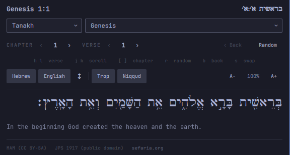
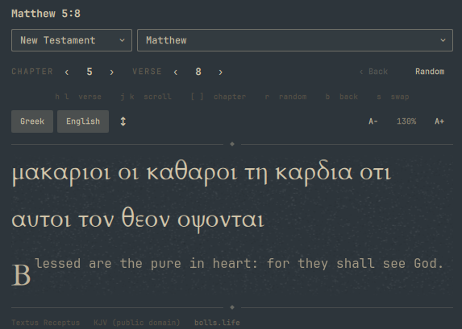
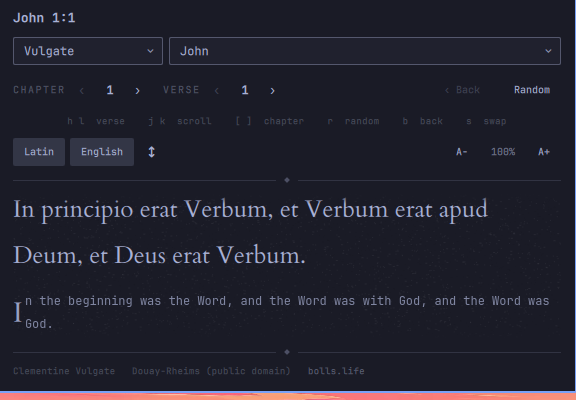
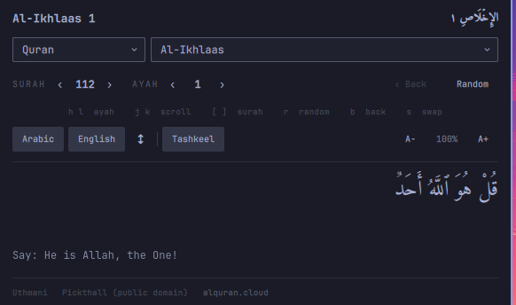
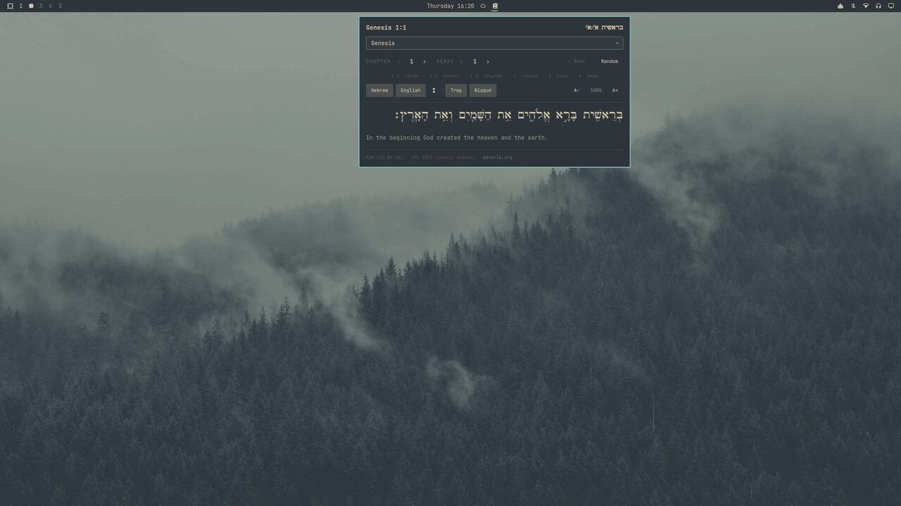
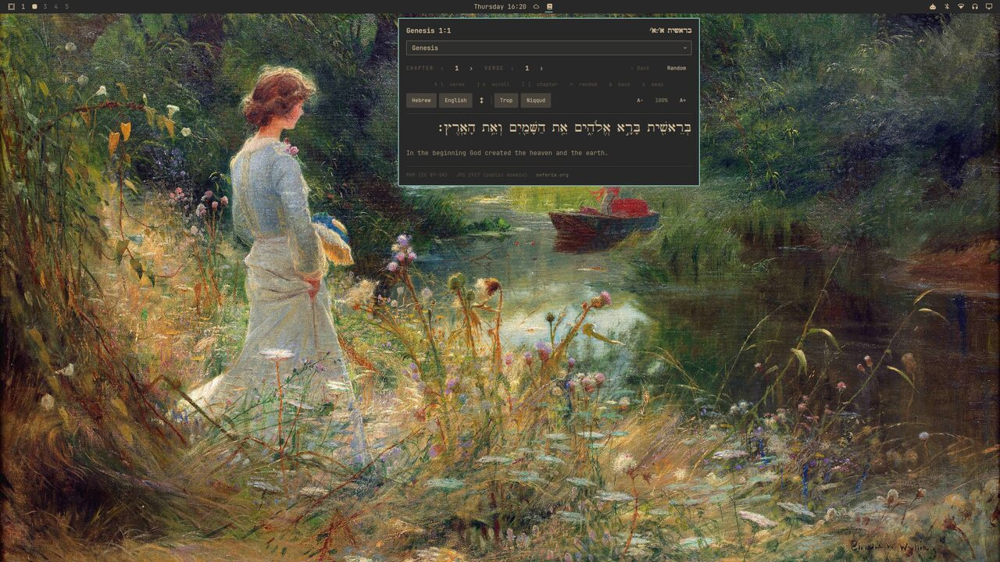
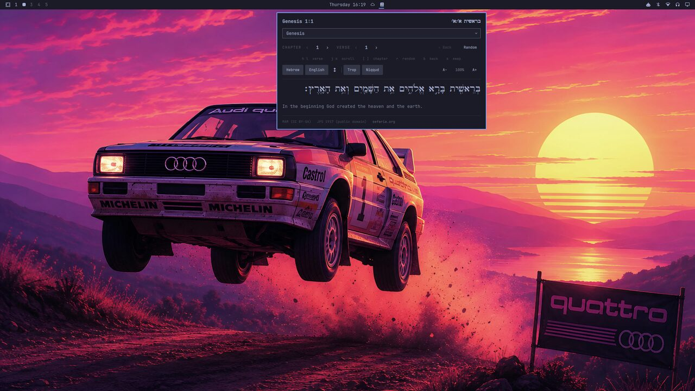
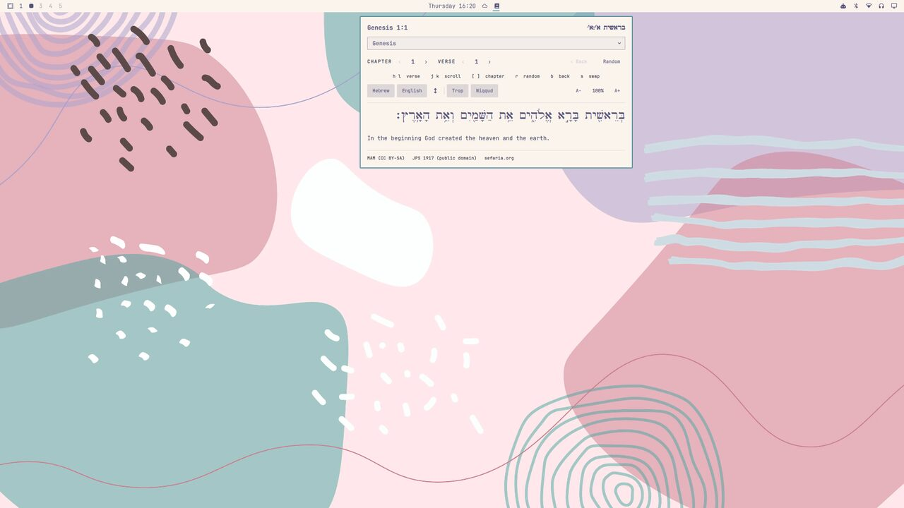

# Verse

An Omarchy bar widget that drops down a small scripture reader. Pick a
passage and see it in the original language alongside a public-domain English
translation, one above the other:

| Corpus | Original | English | Source |
|--------|----------|---------|--------|
| **Tanakh** | Hebrew — the vocalised Masoretic text (MAM) | JPS 1917 | [Sefaria](https://www.sefaria.org) |
| **New Testament** | Greek — the Textus Receptus | King James Version | [bolls.life](https://bolls.life) |
| **Vulgate** | Latin — the Clementine text | Douay-Rheims | [bolls.life](https://bolls.life) |
| **Quran** | Arabic — the Uthmani text | Pickthall (1930) | [AlQuran.cloud](https://alquran.cloud) |

<table>
  <tr>
    <td width="25%" valign="top"></td>
    <td width="25%" valign="top"></td>
    <td width="25%" valign="top"></td>
    <td width="25%" valign="top"></td>
  </tr>
</table>

## Use

- **Left-click** the widget to open the dropdown.
- **Corpus** — the narrow dropdown at top left: Tanakh / New Testament /
  Vulgate / Quran.
- **Book / Surah** — the dropdown next to it (type to filter).
- **Chapter / Verse** (**Surah / Ayah** for the Quran) — the `‹ N ›` steppers.
  The arrows roll across borders and grey out at the ends. Click the **number**
  itself to jump back to 1 (when you're not already there).
- **Random** — a random passage from the current corpus.
- **‹ Back** — return to the passage you were reading before the last jump;
  it keeps a history, so you can step back through several.
- **Middle-click** the bar widget for a random passage without opening it first.
- **Right-click** the bar widget to toggle whether the current reference is
  shown next to the icon in the bar.

The passages either side of where you are (and a little into the neighbouring
chapters), plus a small pool of random passages, are fetched in the
background, so moving around is normally instant. The controls disable
themselves while a passage is actually loading, so mashing them can't queue
up a pile of requests. Each corpus keeps its own place — switch away and
back and you land where you left off.

### Keyboard (with the panel focused)

| key | |
|-----|-----|
| `h` / `l`  (or `←` / `→`) | previous / next **verse** |
| `j` / `k`  (or `↑` / `↓`) | **scroll** a long passage |
| `[` / `]`  (or `H` / `L`) | previous / next **chapter** |
| `r` | random passage |
| `b` | back to the previous passage |
| `s` | swap which script sits on top |
| `−` / `+` | text smaller / bigger |
| `0` | reset text size to 100% |
| `Esc` | close |

### Display

A row of toggles under the navigation:

- **Hebrew / Greek / Arabic** and **English** — show each independently (or
  neither). The label follows the corpus.
- **⇅** — swap which one sits on top (only when both are shown).
- **Trop** — Hebrew cantillation marks (te'amim) on/off. Tanakh only.
- **Niqqud / Tashkeel** — vowel points on/off. Tanakh and Quran.
- **A− / A+** — text size, 75%–250%. Click the **percentage** to reset to 100%.

The steppers know each book's real shape (chapters, and verses per chapter),
so they can't run past the end — from Sefaria's `/api/shape` for the Tanakh,
and from bundled versification tables for the New Testament, Vulgate and
Quran. (The Vulgate Psalms use Septuagint numbering for the Latin, so the
Douay-Rheims chapter is remapped on the fly — off by one through most of the
Psalter.)

The **source** credit on the bottom line is a link — it opens the passage
you're looking at on sefaria.org / bolls.life / quran.com in your browser.

The corpus, the last reference in each corpus, and all display settings are
saved to this widget's entry in `~/.config/omarchy/shell.json`, so the next
time you open it — or restart the shell — you land back where you were.
Nothing else is stored.

## Theming

Verse takes its colours and fonts from the current Omarchy theme — light or
dark — so the dropdown always sits with the rest of the desktop.

<table>
  <tr>
    <td align="center"><br><sub>Everforest</sub></td>
    <td align="center"><br><sub>Gruvbox</sub></td>
  </tr>
  <tr>
    <td align="center"><br><sub>Tokyo Night</sub></td>
    <td align="center"><br><sub>Rose Pine</sub></td>
  </tr>
</table>

## Install

```bash
omarchy plugin add https://github.com/mendelcyprys/verse-omarchy.git --enable
```

Then place it where you want:

```bash
omarchy bar move erikmanhem.verse --section center   # left | center | right
```

## Remove

```bash
omarchy plugin remove erikmanhem.verse
```

To just switch it off without deleting it: `omarchy plugin disable erikmanhem.verse`.

## Requirements & data

- `curl` and an internet connection. Every passage is fetched live when you
  open or navigate; there is no bundled corpus.

| | Text | Licence | Fetched from |
|--|------|---------|--------------|
| Tanakh | *Miqra according to the Masorah* (Hebrew) | CC BY-SA | `www.sefaria.org` |
| | *The Holy Scriptures: A New Translation* — JPS 1917 | public domain | |
| New Testament | Textus Receptus (Greek) | public domain | `bolls.life` |
| | King James Version | public domain | |
| Vulgate | Clementine Vulgate (Latin) | public domain | `bolls.life` |
| | Douay-Rheims | public domain | |
| Quran | Uthmani text (Arabic) | public domain | `api.alquran.cloud` |
| | Pickthall, *The Meaning of the Glorious Koran* (1930) | public domain | |

- Bundled fonts, in `omarchy/fonts/` (both SIL Open Font License):
  **Cardo** (David J. Perry) — Biblical Hebrew with full cantillation, plus
  polytonic Greek and Latin; **Amiri** (the Amiri Project) — a Naskh face for
  the Quran with full harakat. If a file is missing Qt falls back on its own.

The plugin makes outbound HTTPS requests only to those hosts. It writes
only its own widget entry in `shell.json`, via the shell's own
`updateEntryInline` API — no other configuration is touched.

## Developing

Bar-widget QML changes don't always hot-reload cleanly; after editing
`omarchy/Panel.qml` run `omarchy restart shell` to be sure it takes.

## License

MIT for the plugin code — see [`LICENSE`](LICENSE). The bundled fonts are
under the SIL Open Font License (`omarchy/fonts/OFL.txt` for Cardo,
`omarchy/fonts/OFL-Amiri.txt` for Amiri); the scripture texts are under their
own licences as noted above.
